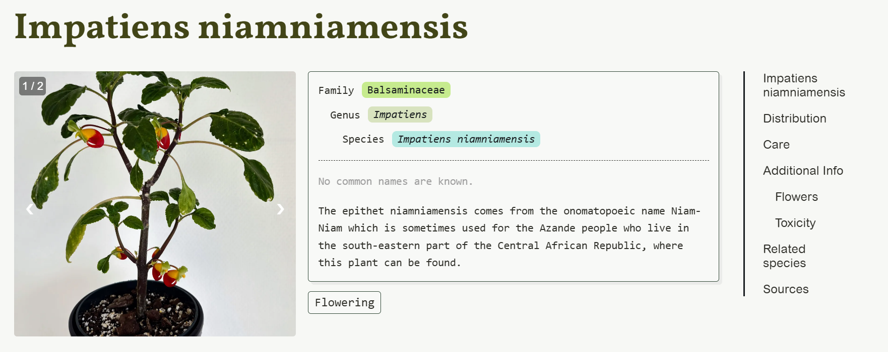

# plantbase

🌿 Plantbase is a free, open-access platform for reliable houseplant care information — no ads, no products, just facts.

[https://houseplantguide.org/](https://houseplantguide.org/)



## Adding plants

All plant data is stored in the `src/plants` folder. This folder contains the subfolders for `familiae`, `genera` and `species`. 

For example to add the plant `Monstera deliciosa` you should add the following files.

1. Add the family of the plant to `src/plants/familiae` (`araceae/araceae.md`)

The family data consists of the `name`, `common_names` and `etymology`.

```yaml
---
name: Acanthaceae
common_names: the acanthus family.
etymology: The family Acanthaceae is named after the <i>Acanthus</i> genus. The name Acanthus comes from the Latin word <i>acanthus</i> meaning <i>thorn</i>.
---
```

2. Add the genus of the plant to `src/plants/genera` (`monstera/monstera.md`)

The genus data consists of the `name`, `common_names` and `etymology`.

```yaml
---
name: Monstera
familia: Araceae
common_names: 
etymology: The word Monstera comes from the Latin word monstrum, meaning monster/wonder/abnormal. It refers to the unusual leaves with natural holes that species within this genus have.
tags:
  - araceae
---
```

3. Add the species of the plant to `src/plants/species` (`monstera-deliciosa/monstera-deliciosa.md`)

```yaml
name: Monstera deliciosa
familia: Araceae
genus: Monstera
common_names: Swiss cheese plant, split-leaf philodendron, fruit salad plant, fruit salad tree or delicious monster.
etymology:

# regions
native: Mexico Gulf, Mexico Southeast, Mexico Southwest
introduced: Seychelles, Society Is., Trinidad-Tobago
iucn_status: unknown

# characteristics
safe_for_pets: false
propagation: 
- stem cutting

# other
# sources: 
#     - https://mrec.ifas.ufl.edu/foliage/folnotes/pilea.htm
# attributes:
#     - title: Cultivars
#       content: This plant has many cultivars. Depending on the cultivar, the color of the leaf and the color of the veins may vary between green, white, pink and red.
```

## Roadmap

Nothing planned for now except for adding plants.